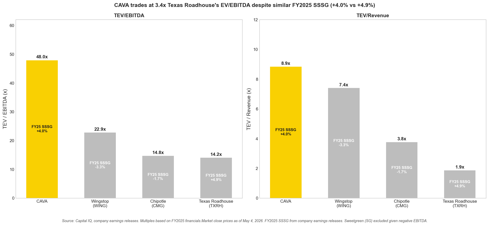
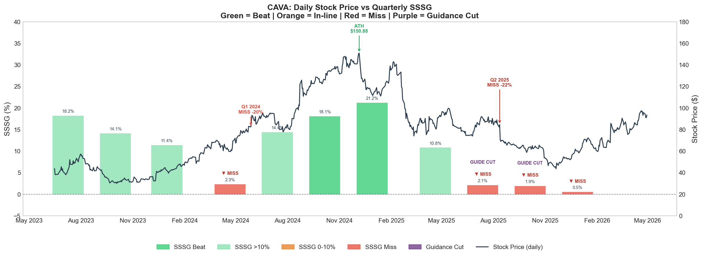
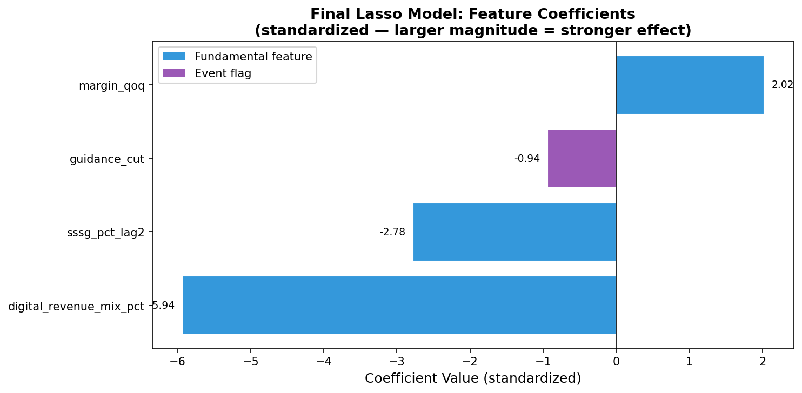
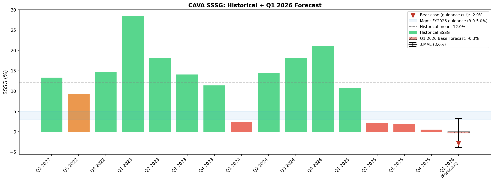

# CAVA Group (NYSE: CAVA) — Investment Memo
Date: May 4, 2026 | Price: $90.98 | Sector: Consumer — Restaurants

## 1. Recommendation

I recommend a neutral-to-cautious view on CAVA into Q1 2026 earnings, with medium event risk and medium conviction. My model forecasts Q1 2026 SSSG below management’s FY2026 guidance range, suggesting downside risk if SSSG (Same Store Sales Growth) recovery remains weak. However, given the small sample size, CAVA’s still-positive relative comp performance versus peers, and constructive qualitative signals from recent earnings commentary, I would frame the view as cautious rather than outright negative.

At approximately 48x EV/EBITDA, CAVA’s premium valuation leaves limited room for another quarter of comp sales disappointment. While the long-term unit growth story remains attractive, the near-term risk is that investors begin to question whether revenue growth is becoming increasingly dependent on new restaurant openings rather than organic same-store momentum.

Direction: Neutral-to-Cautious  
Magnitude: Medium  
Conviction: Medium

---

## 2. Valuation Context

CAVA trades at a meaningful premium to restaurant peers, reflecting investor confidence in its long-term unit growth, strong brand positioning, and attractive restaurant-level economics. However, this premium also increases the stock’s sensitivity to any evidence of slowing same-store sales momentum.

Across the fast-casual and restaurant peer set, FY2025 comp sales trends were pressured, suggesting that part of the slowdown may be sector-wide rather than CAVA-specific. CAVA still delivered positive FY2025 SSSG while several peers posted negative comps, which supports the quality of the brand. The key issue is not whether CAVA is a weak business; rather, it is whether the current valuation already prices in a faster SSSG recovery than the data supports.

---

## 3. Why SSSG Matters

SSSG is one of the most important operating KPIs for CAVA because it captures organic demand strength at existing restaurants, independent of unit count expansion. It reflects a combination of traffic, pricing, menu mix, and store-level productivity.

For a high-growth restaurant company, total revenue growth is driven by two major components: new restaurant openings and same-store sales growth. New units can continue to support top-line growth, but SSSG is important because it indicates whether existing stores are still compounding. Strong SSSG supports the quality of growth; weak or decelerating SSSG suggests that revenue growth may increasingly rely on expansion rather than underlying customer demand.

CAVA’s stock has also shown meaningful sensitivity around SSSG beats and misses. In prior quarters, SSSG misses were followed by sharp stock reactions, while stronger SSSG periods coincided with improved investor sentiment and multiple support. This makes forecasting SSSG useful for near-term positioning.

As SSSG has decelerated from very high post-IPO levels to low single digits, the market’s focus is likely shifting from “how fast can CAVA grow units?” to “can CAVA maintain strong organic growth while scaling?”

---

## 4. Data Science Model & Prediction

I built a next-quarter SSSG forecasting model using Lasso regression with Leave-One-Out Cross Validation. Given the limited number of public-company quarters available for CAVA, Lasso was selected because it performs regularized feature selection and reduces overfitting risk while remaining interpretable.

The final model selected four features:

| Feature | Direction | Investment Intuition |
|---------|-----------|----------------------|
| Digital revenue mix | Bearish | In this sample, higher digital mix has preceded weaker next-quarter SSSG |
| SSSG lag, two quarters ago | Bearish | Strong prior comps create a harder comparison base |
| Margin QoQ change | Bullish | Margin improvement can indicate stronger demand and better store-level execution |
| Guidance cut flag | Bearish | Management guidance cuts have historically aligned with further deceleration |

The most important empirical signal was digital revenue mix. Digital mix reached 38.9%, its highest level in the sample, and showed a negative one-quarter lag relationship with next-quarter SSSG. I interpret this as a directional leading indicator rather than a causal conclusion. One possible interpretation is that rising digital mix may reflect weaker in-store traffic or a shift in demand composition, but further data would be needed to separate traffic, ticket, and channel effects.

| Scenario | Q1 2026 SSSG |
|----------|--------------|
| Model base case | -0.3% |
| Bear case with guidance cut | -2.9% |
| ±MAE uncertainty band | -4.0% to +3.3% |
| Management FY2026 guidance | 3.0% to 5.0% |

CAVA has not historically reported negative SSSG, so the -0.3% base-case forecast should be interpreted more as a signal of material deceleration risk than a precise point estimate. The more actionable takeaway is that the model forecast sits below management’s FY2026 guidance range, suggesting downside risk if Q1 comps do not show a clear recovery.

As a qualitative overlay, transcript NLP from recent earnings calls showed more constructive language around value and pricing, which partially offsets the model’s bearish signal. However, the quantitative model still points to a cautious setup heading into Q1 2026.

---

## 5. Investment Implication

If CAVA reports SSSG above investor expectations, it would support the view that brand momentum remains intact and that the 2025 deceleration was transitory. This would help justify CAVA’s premium valuation and reinforce confidence in the company’s long-term growth algorithm.

However, if CAVA reports another weak SSSG quarter, the market may question whether growth is becoming increasingly dependent on new unit openings rather than organic same-store performance. This matters because new-unit growth alone is typically a lower-quality and more capital-intensive revenue driver than sustained comp growth. At CAVA’s current valuation, even a moderate SSSG miss could have an outsized impact on sentiment.

My conclusion is therefore not that CAVA is a structurally weak business. Rather, my view is that the near-term risk/reward is unfavorable because the stock’s valuation requires a stronger SSSG recovery than my model currently supports.

---

## 6. Risks & Further Work

Key risks to this view:

- Menu innovation could drive a traffic inflection not captured by a backward-looking model.
- A broader fast-casual recovery could lift sector-wide comps and benefit CAVA.
- CAVA’s positive FY2025 SSSG relative to weaker peers suggests the brand may still be outperforming the category.
- The sample size is small, so the forecast should be interpreted directionally rather than statistically definitive.
- Stock reaction will also depend on margins, unit openings, guidance, valuation, and broader market conditions.

Additional work with more time and data:

- Weekly credit card transaction data to separate traffic and ticket effects.
- Foot traffic data to validate whether digital mix is linked to in-store demand softness.
- Store-level opening and maturity data to separate new-unit contribution from mature-store productivity.
- Longer time series or peer-augmented panel model to improve statistical power.

---

Model code and data available at: github.com/zhangsu0528/cava-investment-analysis